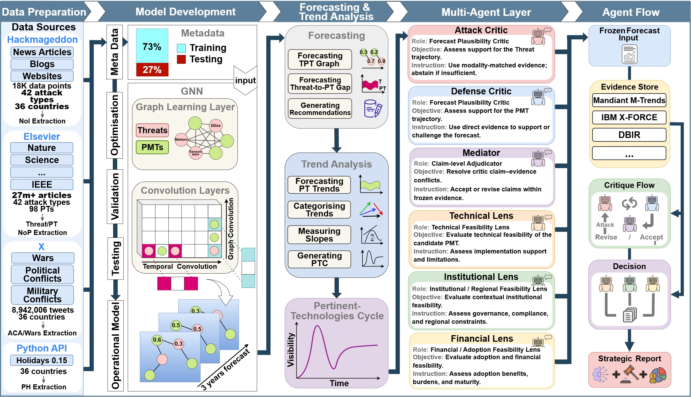
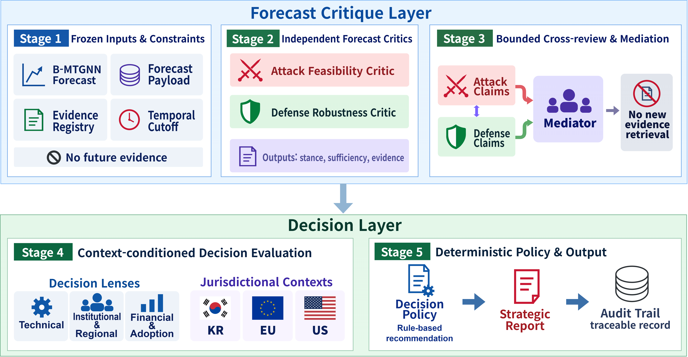

# Context-aware Cyber Foresight with Multi-agent Critique and Strategic Uncertainty

This repository contains the forecasting and multi-agent decision-support pipeline for context-aware cyber foresight. It combines a Bayesian graph-based forecasting model with evidence-grounded critique, structured debate, contextual feasibility analysis, and deterministic decision synthesis.





## Overview

The project has two main layers:

1. **Cyber foresight forecasting** — data preparation, B-MTGNN training, forecasting, and baseline evaluation.
2. **Multi-agent decision support** — a staged LangGraph pipeline that validates forecast interpretations against frozen evidence, evaluates candidate actions across multiple decision lenses, and produces evidence-grounded strategic reports.

The current forecasting contract contains **124 nodes** (26 Threat + 98 PMT) over the **2025–2027** horizon.

## Multi-Agent Pipeline

| Stage             | Role                                                                                             |
| ----------------- | ------------------------------------------------------------------------------------------------ |
| **Stage 0** | Canonical forecast migration, frozen evidence snapshots, deterministic retrieval                 |
| **Stage 1** | Independent Attack Feasibility and Defense Robustness critique                                   |
| **Stage 2** | Evidence-grounded structured debate and bounded Mediator adjudication                            |
| **Stage 3** | Deterministic Common Decision Object and KR/EU/US contextualization                              |
| **Stage 4** | Information-isolated Technical, Institutional/Regional, and Financial/Adoption evaluation        |
| **Stage 5** | Deterministic disagreement, evidence, and context-sensitivity diagnostics                        |
| **Stage 6** | Deterministic decision policy and evidence-grounded strategic report                             |
| **Stage 7** | Validation harness for robustness, architecture/cost, context contribution, and integrity audits |

The active decision pipeline ends at **Stage 6**. Stage 7 evaluates frozen outputs and is not another decision-making agent.

For agent contracts, artifact schemas, runtime details, validation rules, and experiment design, see [`Multi-Agent/README.md`](Multi-Agent/README.md).

## Repository Structure

- `PT_Extractor/` — Pertinent Technology extraction and TPT graph construction.
- `Data_Preparation/` — raw-source processing and time-series feature extraction.
- `Dataset/` — integrated forecasting dataset.
- `B-MTGNN/` — Bayesian graph forecasting model and training pipeline.
- `Comparative_Evaluation/` — B-MTGNN and forecasting baseline evaluation.
- `Multi-Agent/` — Stage 0–7 implementation, frozen artifacts, and orchestration.
- `figure/` — framework figures used by the repository documentation.

`Multi-Agent/Lagacy/` contains the archived pre-redesign agent implementation and is not imported by the active pipeline.

## Installation

The unified environment, B-MTGNN, and the active Multi-Agent pipeline are tested with **Python 3.11**.

For a single Python 3.11 environment covering the repository:

```bash
# Windows
py -3.11 -m venv .venv
.venv\Scripts\activate

# Linux/macOS
# python3.11 -m venv .venv
# source .venv/bin/activate

python -m pip install --upgrade pip
pip install -r requirements.txt
```

For module-level reproducibility, install only the dependencies required by the component you are running:

```bash
pip install -r B-MTGNN/requirements.txt
pip install -r Multi-Agent/requirements.txt
```

The historical data-preparation environment uses older scientific-package pins and should be run under **Python 3.9**:

```bash
# Windows
py -3.9 -m venv .venv-data
.venv-data\Scripts\activate

# Linux/macOS
# python3.9 -m venv .venv-data
# source .venv-data/bin/activate

python -m pip install --upgrade pip
pip install -r Data_Preparation/requirements.txt
```

## Forecasting

### Train B-MTGNN

```bash
cd B-MTGNN
python train.py --data ./data/sm_data.txt --save model/Bayesian/o_model.pt
```

For hyperparameter search:

```bash
python train_test.py
```

### Evaluate Forecasting Models

B-MTGNN:

```bash
cd Comparative_Evaluation/BMTGNN
python BMTGNN.py
```

Example baseline:

```bash
cd Comparative_Evaluation/Baselines/ARIMA
python ARIMA.py
```

Pre-trained B-MTGNN checkpoints are included under `Comparative_Evaluation/BMTGNN/`, and the MTGNN checkpoint is under `Comparative_Evaluation/MTGNN/`.

## Multi-Agent Execution

Run the agent pipeline from `Multi-Agent/`.

### 1. Build Stage 0

Only required when rebuilding the frozen Stage 0 snapshot from source:

```powershell
cd Multi-Agent
py -3 Stage0/cli.py build-stage0 --snapshot-date 2026-09-13 --snapshot-id stage0-2026-09-13-v4
```

### 2. Start the Local LLM Runtime

```powershell
.\Stage1\start_qwen38.ps1
```

The active runtime uses the pinned **Qwen3.8-27B Q6_K_L** GGUF through llama.cpp. The launcher supports environment overrides for machine-specific model/runtime paths; see the Multi-Agent documentation for details.

### 3. Run the Main Pipeline

```powershell
py -3 -m Pipeline.main
```

The main run is resumable and reuses compatible frozen artifacts and checkpoints automatically.

For a small critic smoke test:

```powershell
py -3 -m Pipeline.main --smoke-critics 3 --smoke-seed 202609131
```

### Run the Multi-Agent Regression Suite

```powershell
cd Multi-Agent
py -3.11 -m pytest Stage0/tests Stage1/tests Stage2/tests Stage3/tests Stage4/tests Stage5/tests Stage6/tests Stage7/tests -q
```

## Data and Reproducibility

The repository includes the integrated dataset, forecasting inputs, model artifacts, frozen evidence snapshots, and staged multi-agent outputs required to reproduce the reported experiments.

Key locations:

- `Dataset/CT-0711-0125.csv` — integrated forecasting dataset.
- `B-MTGNN/data/` — model inputs and graph data.
- `Multi-Agent/Results/` — frozen Stage 0–7 artifacts and validation outputs.

The active pipeline uses immutable or content-addressed artifacts where applicable so downstream stages remain tied to exact upstream inputs rather than silently regenerating them.

## Further Documentation

The root README intentionally stays high level. Detailed implementation notes, experiment contracts, runtime profiles, stage-specific commands, and validation methodology are maintained in [`Multi-Agent/README.md`](Multi-Agent/README.md) and within the corresponding module directories.
